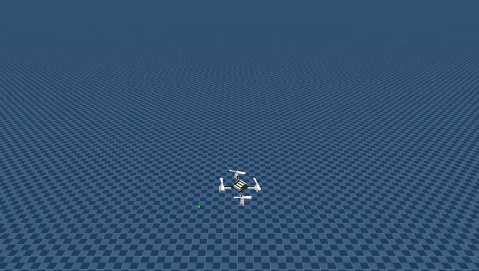
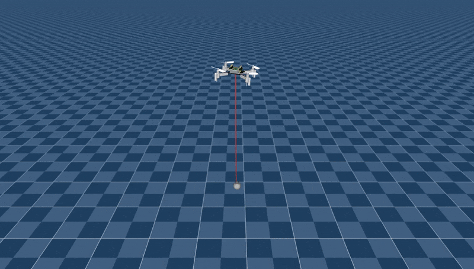
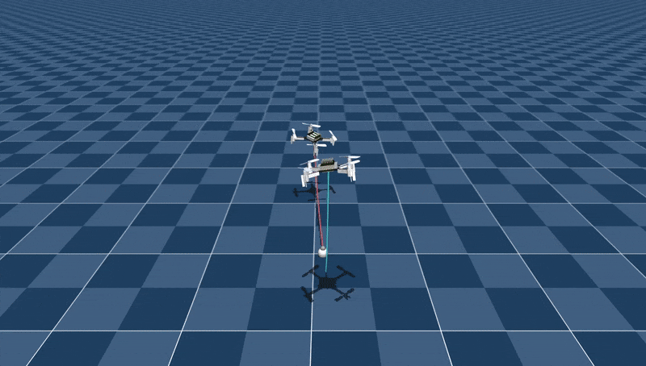
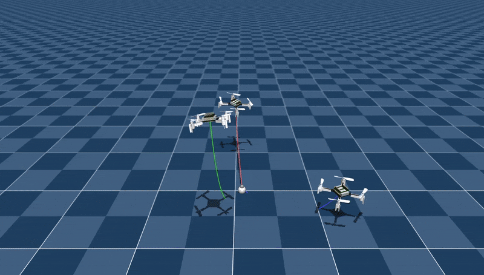

# crazyMARL

crazyMARL is a framework for multi-agent reinforcement learning experiments with Crazyflie quadcopters, built on top of [JaxMARL](https://github.com/flairox/jaxmarl). It provides research-grade implementations of popular algorithms, experiment management, and visualization utilities for simulating and training cooperative multi-quadrotor systems in a performant and flexible way.

## Features

- Multi-agent RL algorithms: IPPO, MAPPO (compatible with JaxMARL)
- JAX and MuJoCo backends for fast simulations
- Batched and single-environment rollouts, video rendering and plotting tools
- Experiment tracking with ASDF format and Weights & Biases integration
- Docker-based development environment for reproducible setups

## Trained Policies
We provide several trained IPPO policies for different scenarios:
- `single_quad_no_payload`: Single quadcopter trained to recover from harsh conditions and track position setpoint
- `single_quad_payload`: Single quadcopter trained to carry a payload and track position setpoint with payload
- `two_quad`: Two quadcopters trained to cooperatively track a position setpoint with payload
- `three_quad`: Three quadcopters trained to cooperatively track a position setpoint with payload

The results can be seen in these videos:

<table>
  <tr>
    <td></td>
    <td></td>
  </tr>
  <tr>
    <td></td>
    <td></td>
  </tr>
  <tr>
       <td></td>
  </tr>
</table>


## Installation
**Clone and install:**
```bash
git clone https://github.com/viktorlorentz/crazyMARL.git
cd crazyMARL
pip install -e .[algs,dev]
```

**Docker (optional):**
```bash
./build.sh    # Build Docker image with or without CUDA support
./run.sh      # Run interactive shell in the container
```

## Quick Start

### Training

Launch training with a predefined configuration:
```bash
python ./crazymarl/train/train.py --config your_config_name
```
Or specify a custom YAML file:
```bash
python ./crazymarl/train/train.py --config-file path/to/config.yaml
```
- Available configs live in `crazymarl/train/configs`:
  - single_quad
  - two_quad
  - three_quad
  - six_quad
  - test

### Flight Experiments & Rollouts

Run flight experiments and render videos:
```bash
python ./crazymarl/experiments/fly.py --config figure_eight --model-path path/to/model.tflite
```
Experiment YAML files are in `crazymarl/experiments/configs`.

